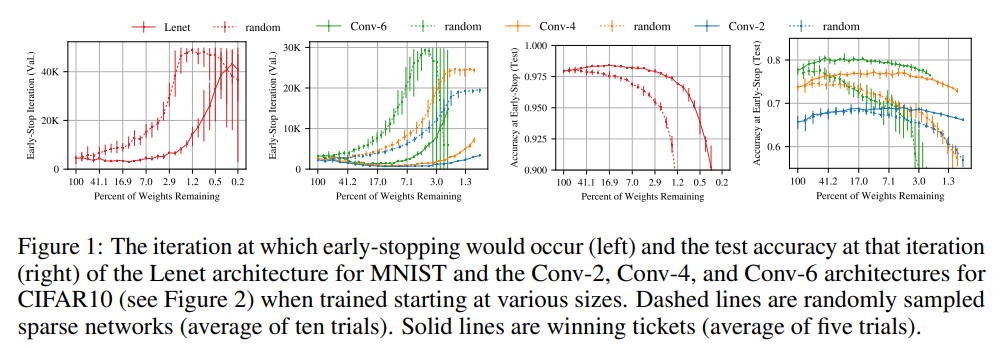
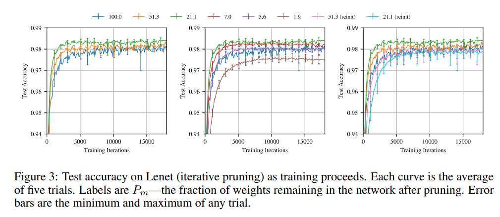
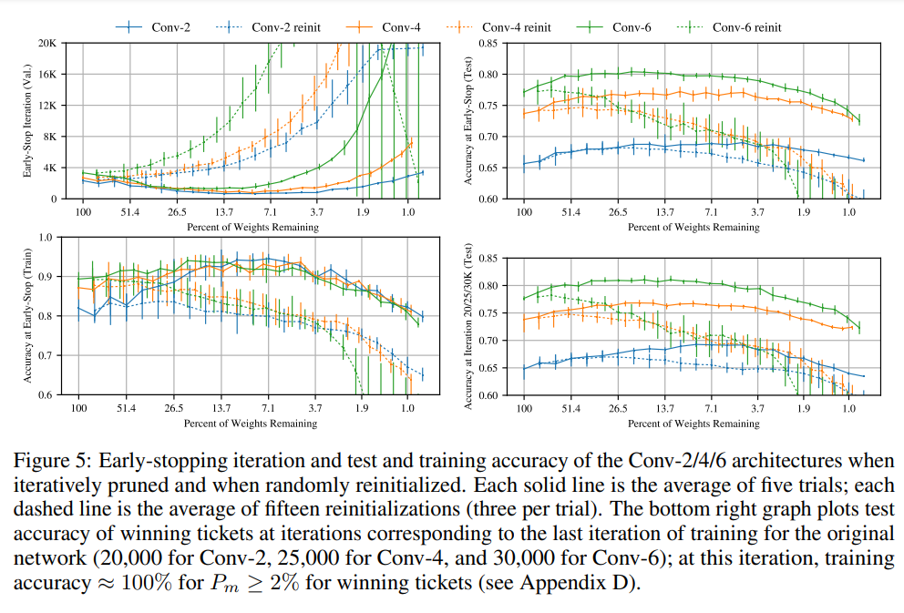
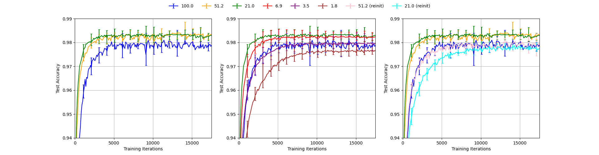

# Reproducing *The Lottery Ticket Hypothesis: Finding Sparse, Trainable Neural Networks*
**Authors:** Michał Grzejdziak (5266440), Sviatoslav Voloshyn (), Wei Wei (), Amos Yusuf ()
***

## 1. Introduction
In this blog post, we present the results of our replication and study of an ICLR 2019 paper by J. Frankle and M. Carbin 
*The Lottery Ticket Hypothesis: Finding Sparse, Trainable Neural Networks* [[1]](#1). The work was conducted as part 
of CS4240 Deep Learning course 2021/22 at TU Delft.

The paper proposes and investigates so-called "Lottery Ticket Hypothesis" which states that *a randomly-initialized, 
dense neural network contains a subnetwork that is initialized such that—when trained in isolation—it can match the test 
accuracy of the original network after training for at most the same number of iterations.* [[1]](#1). To verify this 
claim the authors conduct a series of experiments in which they iteratively train neural networks, prune a percent of their 
smallest magnitude weights and reset the remaining weights to the initial values. In this process, after each iteration
the resulting network has smaller number of parameters. The experiments are performed in four different model+dataset setups: 
1) Lenet-300-100 [[2]](#2) trained on MNIST [[3]](#3), 2) simple convolutional networks trained on MNIST [[3]](#3), 
3) VGG-19 [[4]](#4) trained on CIFAR10 [[5]](#5), and 4) Resnet-18 [[6]](#6) trained on CIFAR10 [[5]](#5). 

Our work targets the replication of the first two setups. We aim to fully reproduce the results from Figure 1, Figure 3
and Figure 5 from the paper. The original figures are shown below. Figure 1 shows that pruning with the iterative pruning
method yields networks which train significantly faster than when random pruning with weight reinitialization is applied.
Figure 3 shows that the test accuracy of the networks pruned and reinitialized this way does not degrade until removing 
as much as more than 98% parameters while for the networks pruned this way but randomly reinitialized it starts degrading
when removing just 50% parameters. Figure 5 provides a more detailed view of the Figure 1 results for Conv-2/4/6 trained 
on MNIST.

***

Figure 1 from the paper

***

***

Figure 3 from the paper

***

***

Figure 5 from the paper

***

In what follows we present and discuss our results. In section 2. we briefly introduce our implementation of the iterative 
pruning using PyTorch as a framework. In section 3. and section 4. we present the results respectively for Lenet-300-100 
trained on MNIST and Conv-2/4/6 trained on MNIST.

## 2. Implementation

## 3. Results for Lenet-300-100 trained on MNIST

Lenet-300-100 is a simple fully-connected network used by Y. LeCun et al. [[2]](#2) as a baseline to compare with their
convolutional neural network. It contains two hidden layers with 300 and 100 output connections respectively and Sigmoid
activation, followed by an output layer with 10 outputs. 

The lottery ticket experiments in [[1]](#1) using Lenet-300-100 are described in detail, but the information necessary
to reproduce them is contained not only in the main part, but also in the appendix which is not referenced by the main 
body of the paper which can be a slight inconvenience for reproduction attempts. The specified training hyperparameters
are: the Adam optimizer with learning rate of 1.2e-3 [[7]](#7), 50K training iterations with minibatches of 60 images, 
training set of 55K images, randomly sampled validation set of 5K images, and test set of 10K images. The network is 
Glorot-initialized [[8]](#8). In each pruning iteration, 20% parameters are pruned from the hidden layers and 10% 
parameters are pruned from the output layer.

One critical hyperparameter is not provided in the paper - the normalization parameters applied on input images before
feeding them to the model. To find the correct values, we performed an ablation study evaluating four possibilities: 1) 
no normalization, 2) naive normalization with mean and standard deviation equal to 0.5, 3) LeCun normalization with mean
equal to 0.078 and standard deviation equal to 0.784, used in [[2]](#2), and 4) MNIST statistics normalization with mean
equal to 0.1307 and standard deviation equal to 0.3081. We present the results of this study in section 3.1. Based on this,
we proceed with MNIST statistics normalization which we deem the most likely to be used by the authors. In section 3.2 and
section 3.3 we present the results of our reproduction on Figure 3 and Figure 1.

### 3.1. Ablation study: searching for the correct normalization parameters

### 3.2. Reproducing Figure 3.

***

Our reproduction of Figure 3

***
The figure above demonstrates our reproduction of Figure 3. The data generated for the graph was averaged over five trials with error bars capturing maximum deviations. Both test and validation accuracy was measured every 100 iterations. Validation accuracy was used as a metric for Figure 3, in accordance with the baseline paper. Error bars are shown each 1000 iterations. 

The general pattern, which holds throughout [[1]](#1) is described by authors as follows:

> "A winning ticket comprising 51.3% of the weights from the original network (i.e., Pm = 51.3%) reaches higher test accuracy faster than the original network but slower than when Pm = 21.1%. When Pm < 21.1%,learning slows (middle graph). When Pm = 3.6%, a winning ticket regresses to the performance of the original network."

The same findings can be drawn from the reproduced Figure 3. The order of the lines (pruning rates) is maintained with the green line representing 21.1% pruning rate peaks the accuracy charts. Moreover, the middle subfigure manifests that the 3.6% pruning rate line is very close to the blue line, representing the unpruned network. Indeed, for even lower pruning rates, performance deteriorates.

In terms of accuracy profiles for individual pruning rates, the graphs do not match exactly. The validation accuracy for the reproduced unpruned graph is around 97.8% in the limit, while the original Figure 3 shows a validation accuracy of just over 98% for very high number of training iterations. Interestingly, this is the only reproduced line, which leaves doubts about any systematic errors. All other pruning rates, including those after re-initialization have been judged to be well within the uncertainty limit of the original graph. 

The uncertainty limits are similar across the five trials. As expected, the error bars in all three plots become slightly smaller with increasing number of training iterations. It is important to keep in mind, that the error bars do not carry any explicit statistical information - they are not an explicit confidence interval. Therefore, it is natural that some of the points in the reproduced graph do not fall within the error bars of the original one. 

### 3.3. Reproducing Figure 1.

## 4. Results for Conv-2, Conv-4 and Conv-6 trained on MNIST

## References
<a id="1">[1]</a> Frankle, J., &#38; Carbin, M. (2019). The Lottery Ticket Hypothesis: Finding Sparse, Trainable Neural Networks. <i>International Conference on Learning Representations</i>. [https://openreview.net/forum?id=rJl-b3RcF7]()

<a id="2">[2]</a> Lecun, Y., Bottou, L., Bengio, Y., &#38; Haffner, P. (1998). Gradient-based learning applied to document recognition. <i>Proceedings of the IEEE</i>, <i>86</i>(11), 2278–2324. [https://doi.org/10.1109/5.726791]()