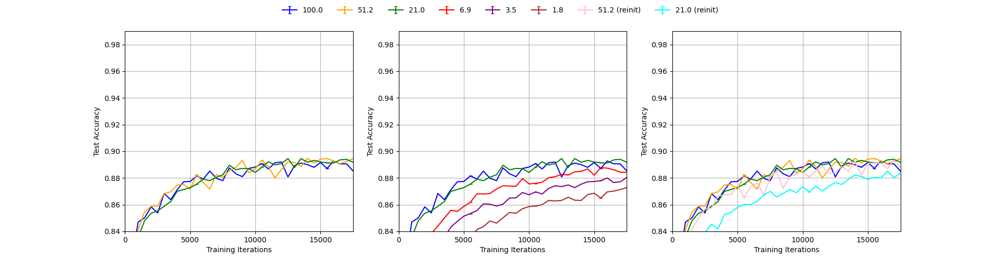
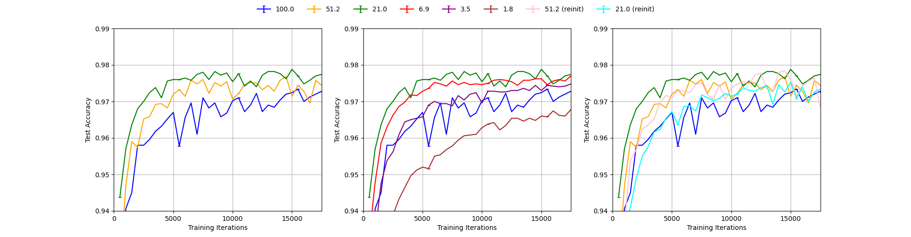
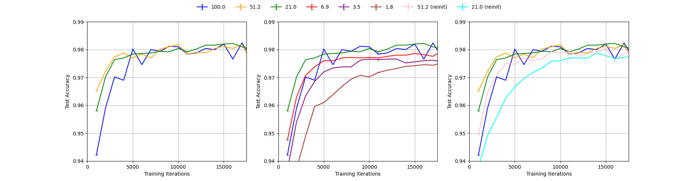
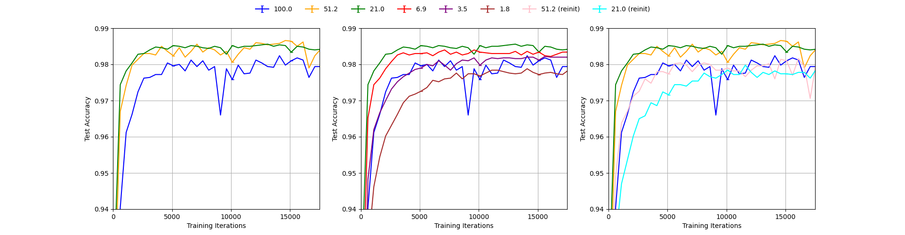
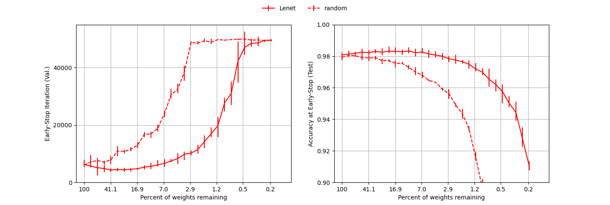
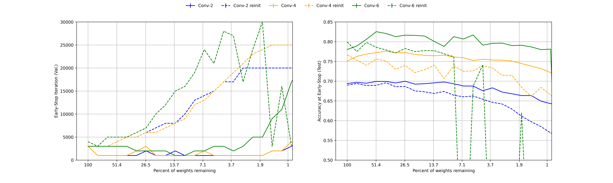

# Reproducing *The Lottery Ticket Hypothesis: Finding Sparse, Trainable Neural Networks*
**Authors:** Michał Grzejdziak (5266440), Sviatoslav Voloshyn (4774361), Wei Wei (5471524), Amos Yusuf (4361504)

***

## 1. Introduction
In this blog post, we present the results of our replication and study of an ICLR 2019 paper by J. Frankle and M. Carbin 
*The Lottery Ticket Hypothesis: Finding Sparse, Trainable Neural Networks* [[1]](#1). The work was conducted as part 
of CS4240 Deep Learning course 2021/22 at TU Delft.

The paper proposes and investigates so-called "Lottery Ticket Hypothesis" which states that *a randomly-initialized, 
dense neural network contains a subnetwork that is initialized such that—when trained in isolation—it can match the test 
accuracy of the original network after training for at most the same number of iterations.* [[1]](#1). To verify this 
claim the authors conduct a series of experiments in which they iteratively train neural networks, prune a percent of 
their weights and reinitialize the remaining weights. In this process, called "iterative pruning", after each iteration 
the resulting network has smaller number of parameters. The authors compare various pruning procedures and show that the
pruning method designed to discover the lottery tickets, which reinitializes the weights to their original values after pruning, 
yields significantly better results than the baselines which reinitialize the remaining weights randomly. The experiments are performed in 
four different model+dataset setups: 1) Lenet-300-100 trained on MNIST [[2]](#2), 2) simple convolutional 
networks trained on CIFAR10 [[3]](#3) defined by the authors [[1]](#1), 3) VGG-19 [[4]](#4) trained on CIFAR10, 
and 4) Resnet-18 [[5]](#5) trained on CIFAR10. 

Our work targets the replication of the first two setups. We aim to fully reproduce the results from Figure 1, Figure 3
and Figure 5 from the paper. The original figures are shown below. Figure 1 shows that pruning with the iterative pruning
method yields networks which train significantly faster than when random pruning with weight reinitialization is applied.
The speed of training is measured by the iteration of early stopping based on validation set. Figure 3 shows that the 
test accuracy of the networks pruned and reinitialized this way does not degrade until removing as much as more than 98% 
parameters while for the networks pruned this way but randomly reinitialized it starts degrading when removing just 50% 
parameters. Figure 5 provides a more detailed view of the Figure 1 results for Conv-2/4/6 trained on CIFAR10.

***
<p align="center">

</p>
Figure 1 from the paper

***
<p align="center">

</p>
Figure 3 from the paper

***
<p align="center">

</p>
Figure 5 from the paper

***

In what follows we present and discuss our results. In section 2. we briefly introduce our implementation of the iterative 
pruning using PyTorch as a framework. In section 3. and section 4. we present the results respectively for Lenet-300-100 
trained on MNIST and Conv-2/4/6 trained on MNIST.

## 2. Implementation

We implemented the experimental setup from scratch using PyTorch. The implementation of the iterative pruning experiments
is included in `main.py` which can be invoked to run a specific arguments based on provided command line arguments. Example
commands which run experiments to replicate in our project are:
```
python main.py --dataset mnist --model lenet300100 --max-iteration 50000 --validate-each 100 --num-repetitions 1 --batch-size 60 --learning-rate 1.2e-3 --prune-rate-fc 0.2 --prune-rate-conv 0.0 --val-set-size 5000
python main.py --dataset cifar10 --model conv2 --max-iteration 20000 --validate-each 100 --num-repetitions 1 --batch-size 60 --learning-rate 2e-4 --prune-rate-fc 0.2 --prune-rate-conv 0.1 --val-set-size 5000
python main.py --dataset cifar10 --model conv4 --max-iteration 25000 --validate-each 100 --num-repetitions 1 --batch-size 60 --learning-rate 3e-4 --prune-rate-fc 0.2 --prune-rate-conv 0.1 --val-set-size 5000
python main.py --dataset cifar10 --model conv6 --max-iteration 30000 --validate-each 100 --num-repetitions 1 --batch-size 60 --learning-rate 3e-4 --prune-rate-fc 0.2 --prune-rate-conv 0.15 --val-set-size 5000    
```
The supported datasets are MNIST [[2]](#2) (`mnist`), Fashion-MNIST [[6]](#6) (`fashion_mnist`), and CIFAR10 [[3]](#3) (`cifar10`).
The supported models are Lenet-300-100 [[2]](#2) (`lenet300100`) and Conv-2/4/6 (`conv2`, `conv4`, `conv6`) from the paper.
Model architectures are defined in separate files `lenet.py`, `conv2.py`, `conv4.py` and `conv6.py`, and their creation is 
managed by a simple factory class defined in `model_factory.py`.

The script `main.py` initializes parameters and runs sequentially three variants of the trainings used in the plots in 
the paper: 1) the lottery tickets pruning (prune the weights of the smallest magnitude and reinitialize the other weights 
to the original values), 2) random pruning (prune random weights and reinitialize the other weights randomly), 3) magnitude 
pruning with reinitialization (prune the weights of the smallest magnitude and reinitialize the other weights randomly).
Each of the above corresponds to one invocation of `run_iterative_pruning` defined in `main.py` which implements iterative 
pruning. For pruning we use high-level PyTorch functions from the module `torch.nn.utils.prune` and for weight initialization
the functions from the module `torch.nn.init`. 

The results are saved in json files named respectively `data.json`, `data_random.json`, and `data_reinit.json`. The fiels 
contain test accuracies, validation accuracies, test losses and validation loss of the respective experiment and some 
additional information which can be helpful in plotting. Example visualization code adjusted for the Lenet+MNIST setup 
is given in `plotter.py`.

## 3. Results for Lenet-300-100 trained on MNIST

Lenet-300-100 is a simple fully-connected network used by Y. LeCun et al. [[2]](#2) as a baseline to compare with their
convolutional neural network. It contains two hidden layers with 300 and 100 output connections respectively and Sigmoid
activation, followed by an output layer with 10 outputs. 

The lottery ticket experiments in [[1]](#1) using Lenet-300-100 are described in detail, but the information necessary
to reproduce them is contained not only in the main part, but also in the appendix which is not referenced by the main 
body of the paper which can be a slight inconvenience for reproduction attempts. The specified training hyperparameters
are: the Adam optimizer with learning rate of 1.2e-3 [[7]](#7), 50K training iterations with minibatches of 60 images, 
training set of 55K images, randomly sampled validation set of 5K images, and test set of 10K images. The network is 
Glorot-initialized [[8]](#8). In each pruning iteration, 20% parameters are pruned from the hidden layers and 10% 
parameters are pruned from the output layer.

One critical hyperparameter is not provided in the paper - the normalization parameters applied on input images before
feeding them to the model. To find the correct values, we performed an ablation study evaluating four possibilities.
We present the results of this study in section 3.1. Based on this, we proceed with MNIST statistics normalization which 
we deem the most likely to be used by the authors. In section 3.2 and section 3.3 we present the results of our 
reproduction on Figure 3 and Figure 1.

### 3.1. Ablation study: searching for the correct normalization parameters

We performed the experiments with 4 different sets of normalization parameters: 1) no normalization, 2) naive normalization 
with mean and standard deviation equal to 0.5, 3) LeCun normalization with mean equal to 0.078 and standard deviation equal 
to 0.784, used in [[2]](#2), and 4) MNIST statistics normalization with mean equal to 0.1307 and standard deviation equal 
to 0.3081. For each setup, we performed a single-run experiment as described above reporting testing accuracy each 500 
training iterations and plotted them the same way as in Figure 3 in the paper, and then compared the resulting plots with 
the paper's plot. We present our results below. 

***
<p align="center">

</p>
Figure 3 from the paper.

***
<p align="center">

</p>
Our reproduction of Figure 3 with no normalization, single run.

***
<p align="center">

</p>
Our reproduction of Figure 3 with naive normalization (mean=0.5, std=0.5), single run.

***
<p align="center">

</p>
Our reproduction of Figure 3 with Lecun normalization (mean=0.078, std=0.784), single run.

***

<p align="center">

</p>
Our reproduction of Figure 3 with MNIST statistics normalization (mean=0.1307, std=0.3081), single run.

***

We can see from the figures that using no normalization yields results significantly worse than the ones reported in 
the paper which is obvious as the curves do not even reach the accuracy of 0.9 in the first 15000 iterations for any 
level of pruning as opposed to the original plot in which all curves reach the level of 0.97. The other three setups give
results much closer to the paper's Figure 3 with MNIST statistics results giving the most similar curves. This can be seen
in the fact that only with this setup, the lottery tickets pruning with 1.8% remaining weights reaches the accuracy of 0.97
within first 5000 iterations as in the original figure. We conclude that it is most likely that the authors used MNIST
statistics to normalize the inputs to the model and use it in our experiments in section 3.2 and 3.3. Analogously, in 
section 4 we use CIFAR statistics to normalize the inputs to the model, without performing further ablation study.

It is interesting to note, that training is very sensitive to normalization parameters, but the lottery ticket hypothesis
claims are quite robust across different setups. In all our plots it can be seen that using random reinitialization gives
worse results than using reinitialization to the original weights as in the lottery tickets pruning. We note however
that the accuracy gap between the two varies across different normalization parameters and is most significant for MNIST
statistics.

### 3.2. Reproducing Figure 3.
***
<p align="center">

</p>
Figure 3 from the paper.

***

<p align="center">

</p>
Our reproduction of Figure 3.

***
The figure above demonstrates our full reproduction of Figure 3. The data generated for the graph was averaged over five trials with error bars capturing maximum deviations. Both test and validation accuracy was measured every 100 iterations. Validation accuracy was used as a metric for Figure 3, in accordance with the baseline paper. Error bars are shown each 1000 iterations. 

The general pattern, which holds throughout [[1]](#1) is described by authors as follows:

> "A winning ticket comprising 51.3% of the weights from the original network (i.e., Pm = 51.3%) reaches higher test accuracy faster than the original network but slower than when Pm = 21.1%. When Pm < 21.1%,learning slows (middle graph). When Pm = 3.6%, a winning ticket regresses to the performance of the original network."

The same findings can be drawn from the reproduced Figure 3. The order of the lines (pruning rates) is maintained with the green line representing 21.1% pruning rate peaks the accuracy charts. Moreover, the middle subfigure manifests that the 3.6% pruning rate line is very close to the blue line, representing the unpruned network. Indeed, for even lower pruning rates, performance deteriorates.

In terms of accuracy profiles for individual pruning rates, the graphs do not match exactly. The validation accuracy for the reproduced unpruned graph is around 97.8% in the limit, while the original Figure 3 shows a validation accuracy of just over 98% for very high number of training iterations. Interestingly, this is the only reproduced line, which leaves doubts about any systematic errors. All other pruning rates, including those after re-initialization have been judged to be well within the uncertainty limit of the original graph. 

The uncertainty limits are similar across the five trials. As expected, the error bars in all three plots become slightly smaller with increasing number of training iterations. It is important to keep in mind, that the error bars do not carry any explicit statistical information - they are not an explicit confidence interval. Therefore, it is natural that some of the points in the reproduced graph do not fall within the error bars of the original one. 

### 3.3. Reproducing Figure 1.
***
<p align="center">

</p>
Figure 1 from the paper.

***

<p align="center">

</p>
Our reproduction of MNIST part of Figure 1.

***
When reproducing Figure 1, we were able to confirm the general claims made throughout the paper. On the left plot, we can see that as the network becomes increasingly more pruned, it requires more iterations to converge to the point of smallest loss. This is in line with our expectations, as smaller networks may be more volatile as they underfit a large dataset. 

On the right plot is the test accuarcy at the early stopping iteration as a function of the degree to which the network has been pruned. The solid line corresponds to the network where the smallest weights have been pruned first (L1 pruning), while the dashed line corresponds to random pruning. When the network is allowed to specialize by pruning the smallest weights first (solid line), we observed a significant boost of accuracy, which is the main contribution of the paper. 

For the solid line we were able to complete five iterations, as was done in the paper. For the dashed line, we only managed to complete three iterations, while the baseline paper used ten. This has an obvious influence on the sizes of the error bars. Nevertheless, we presume that there is some other difference between our and baseline implementations, which makes the sizes of error bars so different, especially after many pruning iterations. It could be that some hyperparameters were incorrectly deduced from the baseline paper or an issue with the baseline paper itself, given the unreasonable sizes of their error bars. 

Other minor inconsistencies of our implementation include the flattening of the dashed line on the left plot as we were only able to perform 50,000 training iterations to find the iteration of early stopping. Thus, our dashed line peaks at 50,000. Finally, our networks in general took slightly more iterations to converge to the minimum loss. The reasons are unclear, though presumably a mismatch in some hyperparameters, as reported at the beginning of this chaper, is to blame.
## 4. Results for Conv-2, Conv-4 and Conv-6 trained on MNIST
### 4.1 Introduction
The authors apply the lottery ticket hypothesis to convolutional networks on the CIFAR10 dataset. These convolutional networks increase both in complexity of the learning problem and in size of the network. The three considered architectures are named Conv-2, Conv-4, Conv-6 and they are scaled down versions (for CIFAR10 dataset)  of the VGG family [3]. The networks contain a series of modules. The modules consist of two layers of 3x3 convolutional filters followed by ReLU activation and a maxpooling layer with a stride equal to 2. For Conv-4 there are two of these modules and for Conv-6 there are three.  Similar to VGG the first module has 64 convolutions in each layer, the second 128 and the third 256. After all the modules there are two fully-connected layers of size 256 and finally an ouput layer of size 10. Please note that there was not explicitly mentioned what type of activation function was used, therefore ReLU was assumed. It is important to mention that similarly to Lenet-300-100 the necessary information for reproduction is partially contained in the main body of the paper and the remainder in the appendix, which is subtly stated as a footnote. Upon careful inspection of the appendix, one notices that the architecture described in the main body does not explicitly mention the output layer of size 10. The correct architecture can eventually be deduced after comparing both descriptions and Figure 2 of the paper.

### 4.2 Reproduced Figure 5
***
<p align="center">

</p>
Figure 5 from the paper.

***
<p align="center">

</p>
Our reproduction of Figure 5.

***
Our figure 5 contains the Early-Stop Iteration(Val) and the Accuracy at Early-Stop(test). This corresponds to the upper left and upper right of the figure from the paper. Important to note is that the early-stopping iteration was chosen at the lowest value of the validation loss. The blue, orange, green lines correspond to the conv2, conv4 and conv6 networks. 
Next to the architecture, the specifications of hyperparameters are provided for Conv-2, Conv-4 and Conv-6 respectively; The Adam optimizer with learning rates of 2e-4, 3e-4 and 3e-4; Training iterations 20K, 25K and 30K with minibatches of 60 images; Pruning rates for convolutional layers 10%, 10%, 15%; Pruning rates for fully-connected layers 20%, 20%, 20%; The output layer is pruned at 10%;  Training set of 50K examples; Validation set of 5K randomly examples; Test set of 10K examples; The networks are Glorot-initialized.
Like Lenet-300-100 a critical hyperparameter is not provided in the paper namely, the normalization parameters applied on the input images before fed to the model.  Based on the ablation study done in the previous section it is likely that dataset statistics was used. The normalization for CIFAR10 used are mean equal to 0.491, 0.482 , 0.447 and std equal to 0.247, 0.243, 0.262. Also, the early stopping criterion is not stated in the paper, e.g. whether to choose the smallest loss and stop or stop after the number of when current accuracy > best accuracy happens is larger than tolerence. Besides, we only did one total execution because the training time is too long for the conv networks(10 hours for one specific network and we have conv2, conv4 and conv6). If we set the execution to 5, we need 150 hours of training and time is not enough. We thus choose one execution loop and made the plot, making it very zigzag and not as smooth as the one in the paper. These are the reasons we can think of what makes our reproduction not perfectly fit the one in the paper. Even still our results fit within the error bounds of the original plot thus supporting the claims made in the paper.

## 5. Discussion
We were able to confirm the main claims of the paper in our experiments, implementing the iterative pruning experiments
from scratch and without using any reference implementation, which demonstrates general reproducibility of the paper. 
The only reproducibility issue of the paper is that it lacks providing normalization parameters for all experiments and 
our ablation study in section 3.1 showed that training is highly sensitive with respect to them. Nonetheless, we were able 
to find values which are likely to be the ones used by the authors. The results which we achieved do not fit perfectly 
the plots in the paper, but the differences are not significant and do not change the strength of the paper's claim.


## 6. Distribution of the efforts
Michał Grzejdziak and Sviatoslav Voloshyn were responsible for the experiments described in section 3. while Wei Wei and 
Amos Yusuf were responsible for the experiments described in section 4. Code implementation was a joint effort in which
Michał Grzejdziak and Sviatoslav Voloshyn implemented the main training loop for MNIST+Lenet and visualization code for 
section 3 while Wei Wei and Amos Yusuf implemented the Conv-2/4/6 models, the visualization code for section 4, reviewed
the main training loop for MNIST+Lenet and adjusted it for the experiments for Conv-2/4/6+CIFAR10.

## References
<a id="1">[1]</a> Frankle, J., &#38; Carbin, M. (2019). The Lottery Ticket Hypothesis: Finding Sparse, Trainable Neural Networks. <i>International Conference on Learning Representations</i>. [https://openreview.net/forum?id=rJl-b3RcF7]()

<a id="2">[2]</a> Lecun, Y., Bottou, L., Bengio, Y., &#38; Haffner, P. (1998). Gradient-based learning applied to document recognition. <i>Proceedings of the IEEE</i>, <i>86</i>(11), 2278–2324. [https://doi.org/10.1109/5.726791]()

<a id="3">[3]</a> Krizhevsky, A. (2009). Learning multiple layers of features from tiny images. [https://www.cs.toronto.edu/~kriz/cifar.html]()

<a id="4">[4]</a> Zisserman, A. &#38; Simonyan, K. (2014). Very deep convolutional networks for large-scale image recognition. [https://arxiv.org/abs/1409.1556]()

<a id="5">[5]</a> He, K., Zhang, X., Ren, S. &#38; Sun, J. (2016). Deep residual learning for image recognition.<i>Proceedings of the IEEE conference on computer vision and pattern recognition</i>, 770-778. [https://ieeexplore.ieee.org/document/7780459]()

<a id="6">[6]</a> Xiao, H., Rasul, K. &#38; Vollgraf, R. (2017). Fashion-MNIST: a Novel Image Dataset for Benchmarking Machine Learning Algorithms. [https://arxiv.org/abs/1708.07747]()

<a id="7">[7]</a> Kingma, D. P. &#38; Ba, L. J. (2015). Adam: A Method for Stochastic Optimization. <i>International Conference on Learning Representations</i>. [https://openreview.net/forum?id=8gmWwjFyLj]()

<a id="8">[8]</a> Glorot, X., &#38; Bengio, Y. (2010). Understanding the difficulty of training deep feedforward neural networks. In Y. W. Teh &#38; M. Titterington (Eds.), <i>Proceedings of the Thirteenth International Conference on Artificial Intelligence and Statistics</i> (Vol. 9, pp. 249–256). PMLR. [https://proceedings.mlr.press/v9/glorot10a.html]()
